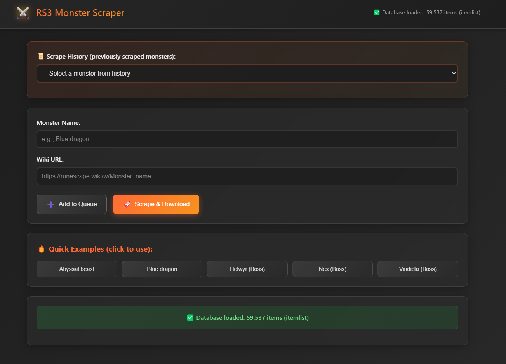
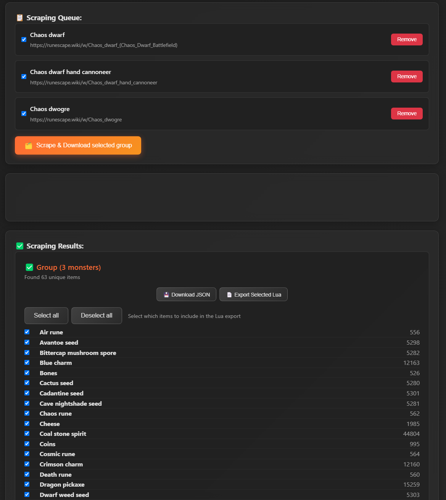

# ⚔️ RuneScape Monster Scraper Desktop

A powerful Electron desktop application for scraping monster drops from RuneScape Wiki with full support for the complete itemlist.json database.



## ✨ Features

- **🔥 Desktop Performance**: No browser limitations - handles large databases efficiently
- **📊 Complete Database**: Uses itemlist.json for maximum accuracy
- **🎯 Smart Item Matching**: Prioritizes tradeable items and handles noted/unnoted variants
- **🚀 Batch & Group Processing**: Queue multiple monsters and scrape them all at once, or select a group for combined export
- **💾 Dual Export Formats**: JSON and Lua export options for maximum compatibility
- **✅ Selectable Drops UI**: Choose which scraped items to include in the Lua export (per-monster or group)
- **🌐 HTTP scraping from Node**: The app performs requests from Node. Note: some sites may present browser challenges (see Troubleshooting)
- **🎨 Modern UI**: Beautiful dark theme with smooth animations
- **⚡ Fast & Reliable**: Native desktop performance

## 🚀 Quick Start
Each monster or group generates a Lua file containing a simple numeric ID array. This format is convenient for AutoLooter-style lists or other scripts that only require item IDs.

Example `blue_dragon_drops.lua`:

### Lua Format
Each monster or group generates a Lua file in the same format. For both single and group exports, the output is always:

```lua
local NPC_LIST = {
   "Blue dragon",

}

local LOOT_LIST = {536, 1751, 1513, ...}
```

Features of the Lua export:
- ✅ Produces a compact numeric array of item IDs (easy to consume in addons/tools)
- ✅ When exporting from the UI you can select which items to include (per-monster or group)
- ✅ Noted items use the correct noted ID via the itemlist noteData mapping

## 📋 How to Use

1. **Launch the app** - The database will automatically load on startup
2. **Add monsters** - Enter monster name and RuneScape Wiki URL
3. **Queue multiple monsters** - Add as many as you want to the queue
4. **History** - Previously scraped monsters are saved and can be reused quickly


5. **Scrape & Download** - Click the button to process all monsters, or select a group and scrape/export as a group
6. **Choose Export Format** - Download as JSON or Lua files to the `/drops` folder
7. **Selectable Drops** - After scraping, select which items to include in the Lua export (per-monster or group)



### ✅ Selectable Drops & Export Selected Lua

After scraping, the app shows a selectable list of the found drops. You can:

- Check/uncheck individual items to include them (default: all checked)
- Use the `Select all` / `Deselect all` buttons for quick changes
- Click `Export Selected Lua` to write only the checked items into the Lua file

The Lua export button writes the selected item IDs (with noted-ID substitution when applicable) to `drops/<monster>_drops.lua` or `drops/group__N_monsters__drops.lua` for group exports.

## 🗂️ Project Structure

```
RuneScape-Monster-Scraper/
├── src/
│   ├── main.js          # Electron main process
│   ├── preload.js       # Secure IPC bridge
│   └── renderer/
│       ├── index.html   # Main UI
│       ├── styles.css   # Modern dark theme
│       └── app.js       # Frontend logic
├── drops/               # Generated JSON and Lua files
├── itemlist.json        # Complete item database
└── package.json         # Project configuration
```

## 📊 Database Support

Uses **itemlist.json** as the primary and only database:
- Accurate item IDs and noted/unnoted mapping (via `noteData`)
- Tradeable detection via `notTradeable` and `is_on_ge` properties

## 🎯 Output Formats

### JSON Format
Each monster or group generates a JSON file like `blue_dragon_drops.json`:

```json
{
   "monster": "Blue dragon",
   "scrapedAt": "2025-10-20T15:30:45.123Z",
   "totalFoundDrops": 25,
   "drops": [
      {
         "itemName": "Dragon bones",
         "itemId": 536
      },
      {
         "itemName": "Blue dragonhide",
         "itemId": 1751
      },
      {
         "itemName": "Magic logs",
         "itemId": 1513
      }
   ]
}
```

### Lua Format
Each monster or group generates a Lua file in the same format. For both single and group exports, the output is always:

```lua
local NPC_LIST = {
   "Monster 1",
   -- Add more monsters if exporting a group
}

local LOOT_LIST = {536, 1751, 1513, ...}
```

If you export a single monster, `NPC_LIST` contains just one name. For a group, it contains all selected monsters. The format is always consistent, making it easy to use in scripts regardless of the number of monsters.

## 🔧 Development

### Available Scripts
- `npm start` - Run the app
- `npm run dev` - Run with DevTools and hot reload

### Tech Stack
- **Electron** - Desktop app framework
- **Node.js** - Backend processing and HTTP requests
- **HTML parsing** - Lightweight regex-based heuristics
- **Modern CSS** - Dark theme UI

## 🛠️ Advanced Features

- **Smart Item Matching**: Direct name lookup, variation handling, tradeable prioritization, charm ID correction, noted item support
- **Selectable Export**: Choose which items to include in Lua export (per-monster or group)
- **Group Scraping**: Select multiple monsters and export combined drops
- **Error Handling**: Network error handling and logging; errors are surfaced to the UI and console
- **Performance**: Progress tracking for long operations (progress bar and status messages)

## 🖥️ UI Features

- **Responsive design** - Works on any screen size
- **Dark theme** - Easy on the eyes
- **Smooth animations** - Professional feel
- **Real-time feedback** - Progress bars and status updates
- **Queue management** - Add/remove monsters easily

## 🛡️ Troubleshooting

**Database not loading:**
- Ensure `itemlist.json` exists in project root
- Check file permissions
- Look at console output for specific errors

**Scraping fails:**
- Verify Wiki URLs are correct and accessible
- Check internet connection
- Monitor console for detailed error messages
   - Note: some wiki pages may return a Cloudflare "challenge" page for non-browser requests. Run the scrape from the Electron app UI (the bundled Chromium) to avoid this, or use a full-browser automation (Puppeteer) for headless verification.

## 🏗️ Building from Source

1. **Clone/Download** the project
2. **Copy database files** (itemlist.json) to project root
3. **Install dependencies:** `npm install`
4. **Run:** `npm run dev`

## 📄 License

MIT License - Created by **KnetterbalScripts**

---

**🎯 Ready to scrape monster drops with maximum accuracy!**