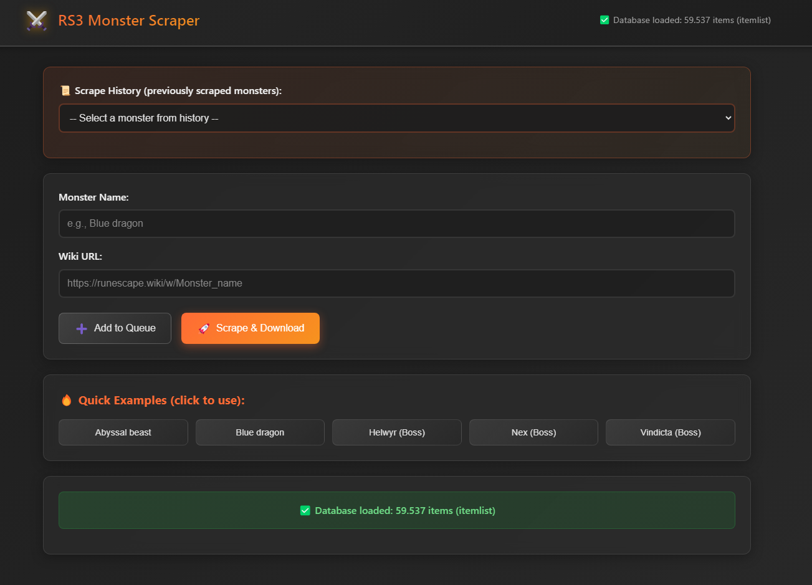

# ⚔️ RuneScape Monster Scraper Desktop

A powerful Electron desktop application for scraping monster drops from RuneScape Wiki with full support for the complete itemlist.json database (59,537 items).



## ✨ Features

- **🔥 Desktop Performance**: No browser limitations - handles large databases efficiently
- **📊 Complete Database**: Uses itemlist.json (59,537 items) for maximum accuracy
- **🎯 Smart Item Matching**: Prioritizes tradeable items and handles noted/unnoted variants
- **🚀 Batch Processing**: Queue multiple monsters and scrape them all at once
- **💾 Dual Export Formats**: JSON and Lua export options for maximum compatibility
- **🌐 No CORS Issues**: Direct HTTP requests without proxy limitations
- **🎨 Modern UI**: Beautiful dark theme with smooth animations
- **⚡ Fast & Reliable**: Native desktop performance

## 🚀 Quick Start

### Prerequisites
- Node.js 16+ installed
- itemlist.json file in the project root

### Installation & Running

1. **Install dependencies:**
   ```bash
   npm install
   ```

2. **Run in development mode:**
   ```bash
   npm run dev
   ```

3. **Run in production mode:**
   ```bash
   npm start
   ```

### Building Executables

**Build for Windows:**
```bash
npm run build-win
```

**Build for all platforms:**
```bash
npm run build
```

## 📋 How to Use

1. **Launch the app** - The database will automatically load on startup
2. **Add monsters** - Enter monster name and RuneScape Wiki URL
3. **Queue multiple monsters** - Add as many as you want to the queue
4. **Scrape & Download** - Click the button to process all monsters
5. **Choose Export Format** - Download as JSON or Lua files to the `/drops` folder

### Quick Examples (Built-in)
- Abyssal beast
- Blue dragon  
- Helwyr (Boss)
- Nex (Boss)
- Vindicta (Boss)

## �️ Project Structure

```
RuneScape-Monster-Scraper/
├── src/
│   ├── main.js          # Electron main process
│   ├── preload.js       # Secure IPC bridge
│   └── renderer/
│       ├── index.html   # Main UI
│       ├── styles.css   # Modern dark theme
│       └── app.js       # Frontend logic
├── drops/               # Generated JSON and Lua files
├── itemlist.json        # Complete item database (59,537 items)
└── package.json         # Project configuration
```

## 📊 Database Support

Uses **itemlist.json** as the primary and only database:
- **59,537 items** with complete metadata
- **Accurate item IDs** from game cache
- **Tradeable detection** via `notTradeable` and `is_on_ge` properties
- **Noted item support** with proper ID mapping
- **~4.8MB** - efficiently handled by desktop app

## 🎯 Output Formats

The scraper supports dual export formats for maximum compatibility with intelligent noted item handling:

### JSON Format
Each monster generates a JSON file like `blue_dragon_drops.json`:

```json
{
  "monster": "Blue dragon",
  "scrapedAt": "2025-10-20T15:30:45.123Z",
  "totalFoundDrops": 25,
  "drops": [
    {
      "itemName": "Dragon bones",
      "itemId": 536
    },
    {
      "itemName": "Blue dragonhide",
      "itemId": 1751
    },
    {
      "itemName": "Magic logs",
      "itemId": 1513
    }
  ]
}
```

**Features:**
- ✅ Clean item names without "(noted)" suffix for perfect string matching
- ✅ Accurate item IDs for both noted and unnoted versions
- ✅ Consistent naming for easy programming integration

### Lua Format
Each monster also generates a Lua file like `blue_dragon_drops.lua`:

```lua
-- Abyssal demon Drops
-- Generated by RS3 Monster Drop Scraper
-- Scraped at: 2025-10-21T06:50:51.321Z
-- Total drops: 64

local Abyssal_demon_drops = {20268, 49402, 30825, 30828, 4151, 1619, 1617, 1631, 44809, 44812, 47240, 47286, 47306, 47312, 995,
               385, 7937, 1514, 570, 47315, 44, 1516, 2435, 1445, 1618, 54709, 15398, 42008, 8264, 18778,
               30139, 30140, 30141, 36814, 12158, 12159, 12160, 12163, 38357, 47658, 39047, 39068, 37952, 39065, 38360,
               13849, 13857, 13856, 13851, 13853, 13847, 13845, 13852, 13848, 13846, 13855, 13854, 13850, 24154, 49423,
               27625, 27624, 52348, 27360}

return Abyssal_demon_drops
```

**Features:**
- ✅ Clean item names for easy string matching: `itemName == "Magic logs"`
- ✅ Noted information preserved via comments: `-- noted`


## 🔧 Development

### Available Scripts
- `npm start` - Run the app
- `npm run dev` - Run with DevTools and hot reload
- `npm run build` - Build for all platforms
- `npm run build-win` - Build for Windows only

### Tech Stack
- **Electron** - Desktop app framework
- **Node.js** - Backend processing with native HTTPS
- **Native HTML parsing** - Regex-based scraping (no external dependencies)
- **Modern CSS** - Beautiful dark theme UI

## 🛠️ Advanced Features

### Smart Item Matching
- **Direct name lookup** first
- **Variation handling** (spaces, apostrophes, parentheses)
- **Tradeable prioritization** automatically
- **Charm ID correction** - Uses original game IDs (12160-12163) instead of Dungeoneering versions
- **Noted item support** with smart name cleaning for consistent string matching
- **Dual format optimization** - Clean names in both formats, noted info preserved via Lua comments

### Export Options
- **JSON format** - Standard structured data format
- **Lua format** - Perfect for RuneScape addons and calculators
- **Dual download buttons** - Choose your preferred format per monster

### Error Handling
- **Automatic retries** on network issues
- **Detailed logging** for debugging
- **User-friendly error messages**

### Performance Optimizations
- **Efficient memory usage** for large datasets
- **Background processing** without UI blocking
- **Progress tracking** for long operations
- **Automatic cleanup** after operations

## � UI Features

- **Responsive design** - Works on any screen size
- **Dark theme** - Easy on the eyes
- **Smooth animations** - Professional feel
- **Real-time feedback** - Progress bars and status updates
- **Queue management** - Add/remove monsters easily

## � Troubleshooting

**Database not loading:**
- Ensure `itemlist.json` exists in project root
- Check file permissions
- Look at console output for specific errors

**Scraping fails:**
- Verify Wiki URLs are correct and accessible
- Check internet connection
- Monitor console for detailed error messages

**Build issues:**
- Run `npm audit fix` to resolve dependency warnings
- Ensure Node.js version is 16+
- Check that all files are present

## 🏗️ Building from Source

1. **Clone/Download** the project
2. **Copy database files** (itemlist.json) to project root
3. **Install dependencies:** `npm install`
4. **Run:** `npm run dev`
5. **Build executable:** `npm run build-win`

## 📄 License

MIT License - Created by **Knetterbal**

---

**🎯 Ready to scrape monster drops with maximum accuracy!**
